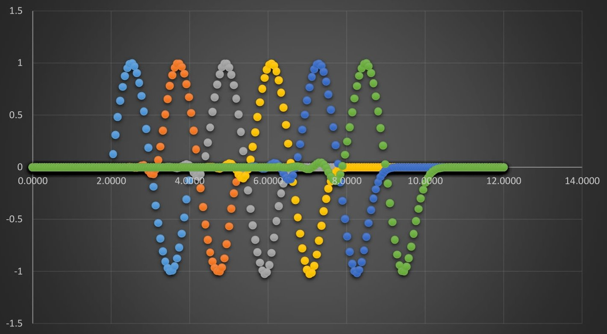

# Code for the course "Numerical Analysis"

## Usage
The code is written in C++ and Mathematica. 

To compile the C++ code, use the following command:
```bash
g++ -o <output_file> <input_file>.cpp
```
To run the compiled C++ code, use the following command:
```bash
./<output_file>
```

To run the Mathematica code, open the file in Mathematica and run the code.

## Set 1

The code in this folder is for the first set of problems. The equation to be solved is:

$$f(x) = cos(x) - 0.026x^2 = 0$$

We first use the x=g(x) method (fixed point iteration) to solve the equation. To do that we need to simplify the equation to the form x=g(x). 

$$x = g(x) = arccos(0.026x^2)$$ 

or 

$$x = g(x) = \sqrt{\frac{cos(x)}{0.026}}$$

or

$$x = g(x) = \frac{cos(x)}{0.026x}$$

We can then select a starting point and iterate the function until we reach the desired accuracy.

`fixed_1.cpp` uses the first form of the equation with $x_0 = 1$ and finds the first root of the equation $x = 1.511371053598$

`fixed_2.cpp` uses the second form of the equation with $x_0 = 6.5$ and finds the third root of the equation $x = 6.187551230230$

`fixed_3.cpp` uses the third form of the equation with $x_0 = 6.5$ and finds the third root of the equation $x = 6.187551230230$

We can then use the Newton-Raphson method to find the roots of the equation. The Newton-Raphson method uses the formula:

$$x_{n+1} = x_n - \frac{f(x_n)}{f'(x_n)}$$

where $f'(x)$ is the derivative of $f(x)$.

For our equation, the derivative is:

$$f'(x) = -sin(x) - 0.052x$$

which we can plug into the formula to get

$$x_{n+1} = x_n - \frac{cos(x_n) - 0.026x_n^2}{-sin(x_n) - 0.052x_n}$$

`newton.cpp` uses the Newton-Raphson method to find all 3 roots of the equation. The user can select the starting point to find the desired root (requires recompilation).

We also had to solve the system of equations:

$$−2x^3 + 3y^2 + 42 = 0$$

$$5x^2 + 3y^3 − 69 = 0$$

using the Newton-Raphson method. 

`newton_system.cpp` uses the Newton-Raphson method to find the solution to the system of equations. The starting point is $x_0 = (5, 5)$, but the user can change it to find the desired solution (requires recompilation). Although the implementation is correct, the method does not converge to the solution.

`set1.nb` contains the Mathematica code for the first set of problems.

## Set 2

The code in this folder is for the second set of problems. The system of equations to be solved is:

$$4x + 3y = 24$$

$$3x + 4y − z = 30$$

$$−y + 4z = −24$$

`gauss.cpp` uses the Gauss-Seidel method to solve the system of equations. The starting point is $x_0 = (1, 1, 1)$. The code finds the solution to the system of equations $x = 3, y = 4, z = -5$.

We also had to find the Lagrange polynomial for the following points:

$$(0, -1), (1, 0.765789), (2, -10.263813)$$

which are part of the function $f(x) = 3x e^x - e^{2x}$.
We can also find the Hermite polynomial for the last two points.

In the following image, we can see the real function in red, the Lagrange polynomial in blue, and the Hermite polynomial in grey.

We notice that the Hermite polynomial is a better approximation of the real function.

`set2.nb` contains the Mathematica code for the second set of problems.

## Set 3

For the third set of problems, we had to calculate the following integral:

$$\int_{0}^{3} \frac{1}{5x^2 + 1} dx$$

`simpson.cpp` uses the Simpson's rule to calculate the integral. The code uses $n = 31$ subintervals, which can be adjusted by the user (requires recompilation). The code finds the value of the integral to be $0.636301999167$	

We also had to solve the integral:

$$\int_{0}^{2\pi} e^{-x/4} sin(20x) dx$$

`simpson2.cpp` uses the Simpson's rule to calculate the integral. The code uses $n = 999$ subintervals, which can be adjusted by the user (requires recompilation). The code finds the value of the integral to be $0.039599888602$

## Set 4

For the fourth set of problems, we had to solve the following differential equation:

$$y'' + \omega^2 y = 0$$

where $\omega = 4$ and $y(0) = 1, y'(0) = 0$.

`rk2.cpp` uses the Runge-Kutta method of order 2 to solve the differential equation. The code outputs the values at `RK2.txt` to be used for plotting.

`rk4.cpp` uses the Runge-Kutta method of order 4 to solve the differential equation. The code outputs the values at `RK4.txt` to be used for plotting.

The following images show the solutions to the differential equation using the Runge-Kutta method of order 2 and 4. With orange being the real solution and blue the approximated solution.


We also had to solve the following differential equation:

$$y' = -10 \frac{y^2}{x}$$

where $y(0.1) = 1$.

`rk_shooting.cpp` uses the shooting method to solve the differential equation. The code uses the Runge-Kutta method of order 2 to solve the differential equation. The code outputs the values at `RK2_shooting.txt` to be used for plotting. The values of y get to infinity, which is not correct, but was the intended result, to show that the method does not converge.

## Set 5
For the fifth set of problems, we had to solve the boundary value problem:

$$u_{xx} + u_{yy} = 10.0e^{-0.5(\sqrt{(x-0.5)^2 + (y-0.5)^2})}$$

with the boundary conditions: $ u(x, y) = 1.0$ in all the boundaries.

`liebmann.cpp` uses the Liebmann method to solve the boundary value problem. The code outputs the values at `matrix.txt` to be used for plotting.

`liebmann.nb` contains the Mathematica code for the Liebmann method.

The following images show the solution to the boundary value problem using the Liebmann method.


We also had to solve the wave equation:

$$u_{tt} - \alpha^2 u_{xx} = 0$$

with $\alpha^2 = \frac{2}{\pi^2}$ in the interval $0 \leq x \leq 12$ and with the initial conditions: $ u(x, 0) = sin(\pi x) $ for $2 \leq x \leq 4$ and $u(x, 0) = 0$ for $0 \leq x < 2$ and $4 < x \leq 12$ and the boundary conditions: $u(0, t) = 0$ and $u(12, t) = 0$.

`lax.cpp` uses the Lax-Wendroff method to solve the wave equation. The code outputs the values at `wave.txt` to be used for plotting.

The following images show the solution to the wave equation using the Lax-Wendroff method. With light blue is the wave at $t = 0$, orange at $t = \pi$, grey at $t = 2\pi$, yellow at $t = 3\pi$, blue at $t = 4\pi$, and green at $t = 5\pi$.
